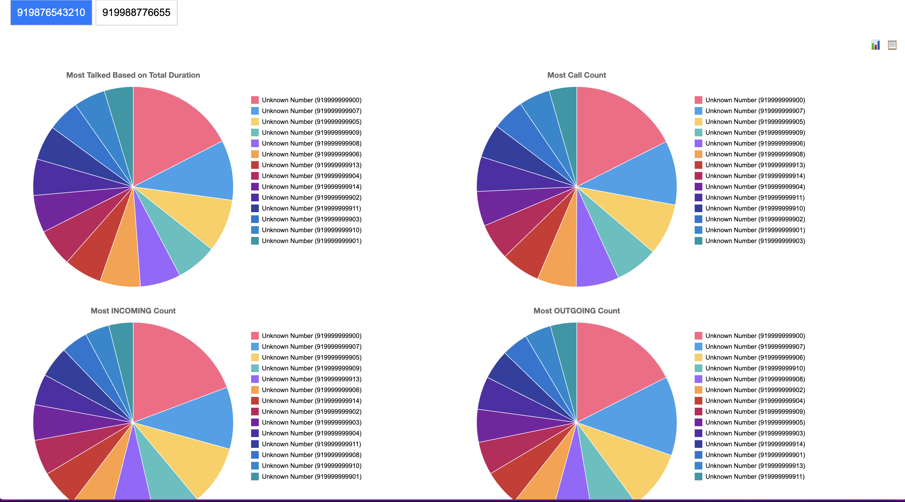
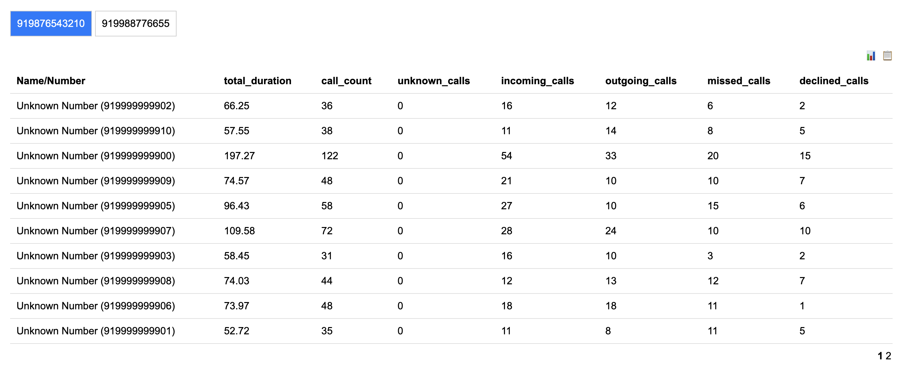

# 📞 Call Log Analyzer

Welcome to **Call Log Analyzer**! This simple and intuitive web app lets you visualize your call logs in a beautiful chart format. Whether you want to explore your call data offline or test with a sample, we've got you covered! 🎉

## 🚀 Features

- **Interactive Visualizations**: Easily understand your call patterns with interactive charts.
- **Privacy First**: Your data stays with you. No data is sent to any server.
- **Offline Usage**: Run the app locally without internet access.
- **Sample Data Included**: Try out the app with a dummy JSON file before using your own data.

## 🔒 Privacy

Your privacy is our priority. Here's how we ensure it:
- **Local Processing**: All call log data is processed directly in your browser. No data is sent to a server.
- **Open Source**: Review the code yourself to see how it works and ensure your data stays safe.

## 🛠️ How to Use

Export the call logs from your Android device using this open-source app: [SMS Import / Export](https://f-droid.org/packages/com.github.tmo1.sms_ie/). Don't be confused by the app name, although it mentions only SMS, it allows you to export `Call logs` as well. [Source Code](https://github.com/tmo1/sms-ie)

OR

Use the included [sample-calls-logs.json](./test-data/sample-calls-logs.json) file to see how the app works.

### Option 1: Run Locally (Recommended)

1. **Download the Project**
   - Clone the repository or download the ZIP file.
   ```bash
   git clone https://github.com/guruor/analyze-call-logs.git
   ```

2. **Open `index.html`**
   - Navigate to the project directory and open the `index.html` file in your browser.
   - You can simply double-click the file, or open it from your browser's file menu.

3. **Load the Sample Data**
   - Click on the "Upload JSON" button in the app.

### Option 2: Test with Sample Data

1. **Visit the Hosted Instance**
   - Check out the live demo at [Hosted Instance URL](https://guruor.github.io/analyze-call-logs/) 🌐

2. **Load the Sample Data**
   - Click on the "Upload JSON" button in the app.

## 🖼️ Screenshots




## 🌟 Contributing

This project thrives on community contributions! Feel free to submit issues and pull requests. Let's make this tool even better together!

---

Give the app a try and visualize your call logs like never before! 🚀✨
